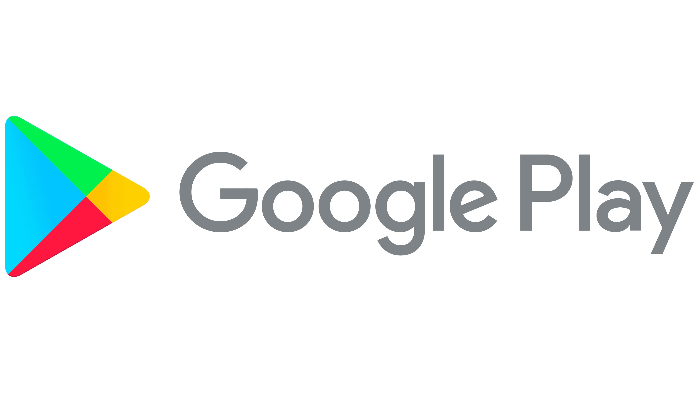

# **The Android App Market on Google Play**

This repository include/s the second project(s) under Data Scientist with Python career track from [DataCamp](https://www.datacamp.com/tracks/data-scientist-with-python), which entails loading, cleaning, and visualizing scraped Google Play Store data to gain insights into the Android app market.

*Note: The pre-requisites of the project(s) are the courses: Joining Data with pandas and Python Data Science Toolbox (Part 1)*

## :computer: Project Description (from DataCamp)
> Mobile apps are everywhere. They are easy to create and can be lucrative. Because of these two factors, more and more apps are being developed. In these project/s, you will do a comprehensive analysis of the Android app market by comparing over ten thousand apps in Google Play across different categories. You'll look for insights in the data to devise strategies to drive growth and retention.

> The [data](https://www.kaggle.com/lava18/google-play-store-apps) for this project was scraped from the [Google Play website](https://play.google.com/store/apps?hl=en). While there are many popular datasets for Apple App Store, there aren't many for Google Play apps, which is partially due to the increased difficulty in scraping the latter as compared to the former. The data files are as follows: 
>> *apps.csv* : contains all the details of the apps on Google Play. These are the features that describe an app.
>> *user_reviews.csv* : contains 100 reviews for each app, [most helpful first](https://www.androidpolice.com/2019/01/21/google-play-stores-redesigned-ratings-and-reviews-section-lets-you-easily-filter-by-star-rating/). The text in each review has been pre-processed, passed through a sentiment analyzer engine and tagged with its sentiment score.

## :keyboard: Projects
- [Guided Project](https://github.com/zwnq/The-Android-App-Market-on-Google-Play/blob/main/Guided%20Project/notebook.ipynb)
- Unguided Project (not yet taken)
